# Component Architecture & Data Flow

This document explains the complete architecture of messy-ui's component system, including how **Preview Component**, **Usage Code**, **Component Code**, and **Meta Files** work together.

---

## High-Level Overview

```mermaid
flowchart TB
    subgraph Registry["📁 registry/new-york/[component]/"]
        META["meta.ts"]
        COMPONENT["component.tsx"]
        INDEX["index.ts"]
    end
    
    subgraph Config["📁 src/config/"]
        COMPONENTS_TS["components.ts"]
        TYPES["types.ts"]
    end
    
    subgraph Page["📁 src/app/components/[slug]/"]
        PAGE["page.tsx"]
        ANIMATED["animated-content.tsx"]
    end
    
    subgraph DocsComponents["📁 src/components/docs/"]
        PREVIEW["components-preview.tsx"]
        INSTALL["installation-section.tsx"]
        PROPS["props-table.tsx"]
    end

    META --> INDEX
    COMPONENT --> INDEX
    INDEX --> COMPONENTS_TS
    TYPES --> COMPONENTS_TS
    COMPONENTS_TS --> PAGE
    PAGE --> ANIMATED
    ANIMATED --> PREVIEW
    ANIMATED --> INSTALL
    ANIMATED --> PROPS
```



---

## File Structure

Each component in the registry follows this structure:

```
registry/new-york/
└── [component-name]/
    ├── index.ts           # Barrel exports
    ├── [component].tsx    # Actual component implementation
    ├── meta.ts            # Metadata, usage code, component code
    └── [hooks].tsx        # Optional: custom hooks
```

---

## Data Flow Diagram


---

## Meta File Structure

The `meta.ts` file is the central configuration for each component. It exports three things:

### 1. `usageCode` (string)
A short, practical usage example shown in the **Preview → Code** tab.

```typescript
export const usageCode = `import { Separator } from "@/components/separator";

export default function ContentDivider() {
  return (
    <div className="w-full">
      <h2>Section One</h2>
      <Separator />
      <h2>Section Two</h2>
    </div>
  );
}`;
```

### 2. `componentFiles` (ComponentFileRef[])
File references for **build-time loading**. Instead of duplicating component code as a string, you reference the actual source files:

```typescript
import { ComponentFileRef } from "@/config/types";

export const componentFiles: ComponentFileRef[] = [
  {
    filename: "separator.tsx",
    targetPath: "ui/separator.tsx",
    sourcePath: "./separator.tsx",
  },
];
```

These files are loaded at build time using `fs.readFileSync` in `components.ts`, keeping your code DRY.

### 3. `meta` (ComponentMeta)
Configuration object with all metadata:

```typescript
const meta: ComponentMeta = {
  // Identity
  slug: "separator",
  name: "Separator",
  category: "Layout",
  aliases: ["divider", "wobble-separator"],
  
  // SEO
  seoTitle: "Separator - Interactive Wobble Animation | messy-ui",
  seoDescription: "An interactive separator component...",
  keywords: ["separator", "divider", "wobble animation"],
  
  // Behavior
  sandbox: "inline",  // or "iframe" for isolated preview
  registryUrl: "https://messyui.dev/r/separator.json",
  
  // Dependencies
  dependencies: ["gsap"],
  cliDependencies: [],  // For shadcn or other CLI installs
  
  // UI Configuration
  props: [
    {
      name: "baseY",
      type: "number",
      default: "50",
      description: "Vertical position of the line",
      control: "slider",
      min: 10,
      max: 90,
      step: 5,
    },
    // ... more props
  ],
  
  // Optional
  notes: [
    { type: "tip", message: "Adjust damping for more bounce." },
    { type: "info", message: "Uses GSAP for animations." },
  ],
  snippets: [],  // Additional CSS or config files
};
```

---

## How Each Piece Is Used

### Where `usageCode` Goes


The `usageCode` is displayed in the **Code tab** of the preview section, showing users how to import and use the component.

---

### Where `componentFiles` Goes


The `componentFiles` references are resolved at build time by `loadComponentFiles()`, which reads the actual source files. The loaded code is then displayed in the **Manual installation tab**.

---

### Where `meta` Properties Go

| Property | Used By | Purpose |
|----------|---------|---------|
| `slug` | URL routing | `/components/[slug]` |
| `name` | Header, cards | Display name |
| `category` | Filtering | Component gallery |
| `aliases` | URL routing | Redirect old URLs |
| `seoTitle` | `<title>` | Browser tab + Google |
| `seoDescription` | `<meta>` | Search results |
| `keywords` | Badge display | Tags under component |
| `sandbox` | Preview | `inline` or `iframe` |
| `registryUrl` | CLI tab | `npx shadcn add [url]` |
| `dependencies` | Manual tab | `npm install [deps]` |
| `cliDependencies` | Manual tab | Pre-install commands |
| `props` | PropsTable | Documentation + Playground |
| `notes` | Above tabs | Info/warning/tip boxes |
| `snippets` | Manual tab | Additional code (CSS, etc.) |

---

## Component Registration Flow


---

## Component Config Builder

In `src/config/components.ts`, the `buildComponentConfig` function merges everything:

```typescript
import { loadComponentFiles, getRegistryPath } from "@/lib/component-loader";

function buildComponentConfig(
  meta: ComponentMeta,
  component: React.ComponentType | React.LazyExoticComponent<any>,
  usageCode: string,
  componentCode: string | ComponentFile[]
): ComponentConfig {
  return {
    ...meta,           // All metadata properties
    component,         // Lazy-loaded React component
    usageCode,         // Short usage example
    componentCode,     // Full source for manual install
  };
}

// Example usage with file loading:
buildComponentConfig(
  separatorMeta,
  Separator,
  separatorUsage,
  loadComponentFiles(getRegistryPath("separator"), separatorFiles)
);
```

---

## Type Definitions

### ComponentMeta
Static metadata stored in `meta.ts`:
- Identity (slug, name, category, aliases)
- SEO (seoTitle, seoDescription, keywords)
- Configuration (sandbox, registryUrl)
- Dependencies (dependencies, cliDependencies)
- Props definition (props[])
- Optional (notes, snippets, thumbnailUrl)

### ComponentConfig
Full config with component + code:
- Everything from `ComponentMeta`
- `component`: React component reference
- `usageCode`: Preview code example
- `componentCode`: Full source for install

---

## Preview Component Flow


---

## Installation Section Flow


---

## Quick Reference

| What you want | Where it's defined | Where it's displayed |
|---------------|-------------------|---------------------|
| Live component preview | `[component].tsx` | Preview tab |
| Short usage example | `meta.ts → usageCode` | Code tab |
| Full component source | `meta.ts → componentCode` | Manual install |
| CLI install command | `meta.ts → registryUrl` | CLI tab |
| Props documentation | `meta.ts → props[]` | Props table + playground |
| Dependencies | `meta.ts → dependencies` | Manual install step |
| Notes/warnings | `meta.ts → notes[]` | Above installation tabs |
